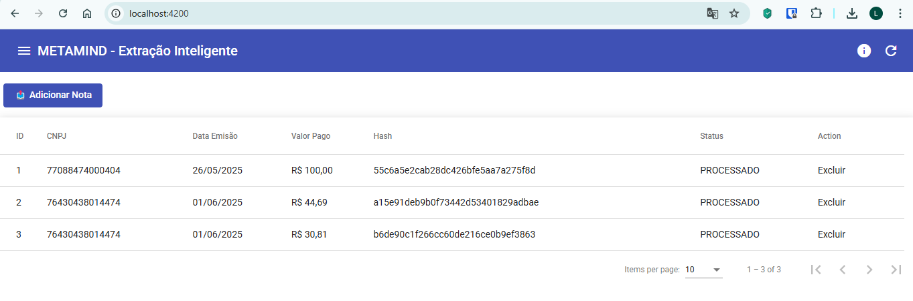
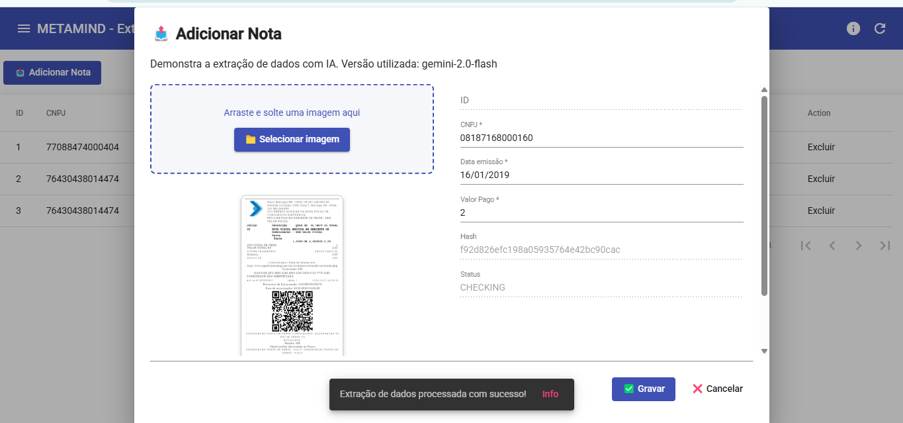
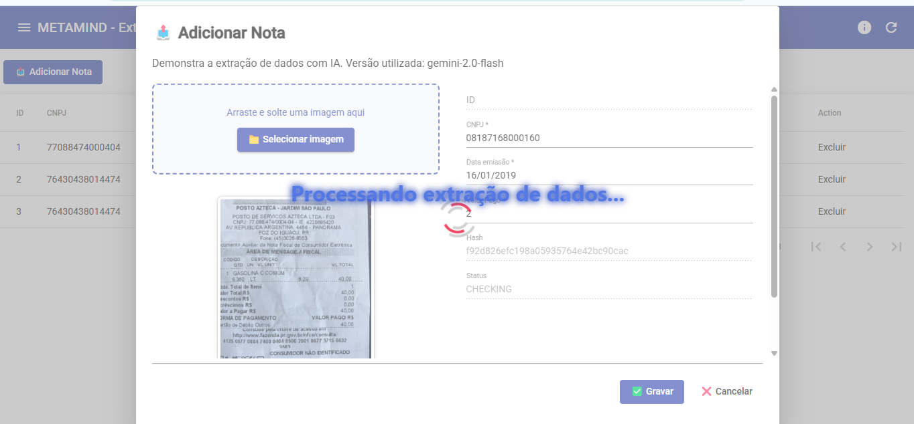

# poc-fastapi-llm-ocr-frontend

Frontend utilizado na POC Fastapi com Gemini. Criado para o segundo trabalho do curso da I1A2 em Junho de 2025.

https://github.com/lyndontavares/poc-fastapi-llm-ocr

